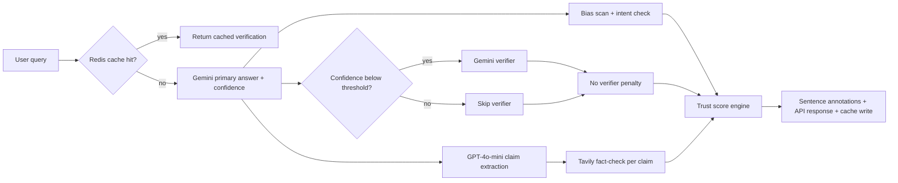

# AI Trust Sentinel

AI Trust Sentinel is a trust layer for AI answers. It takes a user query, generates a response, extracts factual claims, checks those claims against the live web, and returns a 0-100 trust score with sentence-level evidence.

This repo already has the bones of a strong open-source project:

- A real multi-stage verification pipeline instead of a thin chat wrapper
- A polished React UI with trust meters, claim drawers, and sentence inspection
- A FastAPI backend that exposes the pipeline as an API
- Clear deployment targets for Vercel and Railway

> Public cloud demo is not live yet. That is now an explicit roadmap item, not hidden debt.

## Why It Is Interesting

- Primary answer plus confidence scoring
- Verifier model for low-confidence answers
- Claim extraction with GPT-4o-mini
- Live web fact-checking with Tavily
- Bias and intent-alignment checks
- Sentence-level annotations and source chains
- Redis caching for repeat queries and demos

## The 7-Stage Pipeline



### What Each Stage Does

1. Cache lookup returns repeated queries instantly.
2. The primary model generates an answer and self-reported confidence.
3. The confidence gate decides whether the answer needs a second opinion.
4. A verifier model answers the same question independently when confidence is low.
5. GPT-4o-mini extracts concrete factual claims from the primary answer.
6. Tavily checks each claim against live web results.
7. The trust-score engine combines confidence, agreement, fact-checking, bias, and intent signals into the final response.

## Example Response

```json
{
  "trust_score": 82,
  "trust_label": "MODERATE CONFIDENCE",
  "answer": "The Eiffel Tower was built for the 1889 World's Fair and was originally intended to be temporary.",
  "confidence": 88,
  "verifier_used": false,
  "claims": [
    {
      "text": "The Eiffel Tower was built for the 1889 World's Fair.",
      "status": "VERIFIED",
      "source_url": "https://www.toureiffel.paris/en/the-monument/history",
      "source_title": "History of the Eiffel Tower"
    }
  ],
  "sentences": [
    {
      "text": "The Eiffel Tower was built for the 1889 World's Fair.",
      "status": "VERIFIED",
      "claim_ref": "The Eiffel Tower was built for the 1889 World's Fair.",
      "source_url": "https://www.toureiffel.paris/en/the-monument/history"
    }
  ],
  "from_cache": false,
  "latency_ms": 1842,
  "error": null
}
```

## Tech Stack

- Backend: FastAPI, Redis, Gemini, GPT-4o-mini, Tavily
- Frontend: React, Vite, Tailwind
- Deployment targets: Railway for the API, Vercel for the frontend

## Quick Start

### 1. Backend

```bash
cd backend
python -m venv venv
venv\Scripts\activate
pip install -r requirements.txt
Copy-Item .env.example .env
uvicorn main:app --reload --port 8000
```

Mac or Linux:

```bash
cd backend
python -m venv venv
source venv/bin/activate
pip install -r requirements.txt
cp .env.example .env
uvicorn main:app --reload --port 8000
```

### 2. Frontend

```bash
cd frontend
npm install
Copy-Item .env.example .env.local
npm run dev
```

Mac or Linux:

```bash
cd frontend
npm install
cp .env.example .env.local
npm run dev
```

The frontend defaults to `http://localhost:8000/api` unless you override `VITE_API_URL`.

## Environment Variables

### Backend

`backend/.env.example` includes:

- `OPENAI_API_KEY`
- `GEMINI_API_KEY`
- `TAVILY_API_KEY`
- `REDIS_URL`
- `GEMINI_PRIMARY_MODEL`
- `GEMINI_VERIFIER_MODEL`
- `OPENAI_EXTRACTION_MODEL`
- `CONFIDENCE_THRESHOLD`
- `CACHE_TTL_SECONDS`
- `MAX_CLAIMS`
- `MAX_TAVILY_RESULTS`
- `OFFLINE_MODE`

### Frontend

`frontend/.env.example` includes:

- `VITE_API_URL`

## Local Verification

When you have real API keys configured, run:

```bash
python test_keys.py
```

For contributor smoke tests that do not require live keys:

```bash
python -m unittest discover -s backend/tests -v
```

Build the frontend:

```bash
cd frontend
npm run build
```

## API

### `POST /api/verify`

```bash
curl -X POST http://localhost:8000/api/verify \
  -H "Content-Type: application/json" \
  -d "{\"query\":\"Was the Eiffel Tower meant to be temporary?\"}"
```

### `GET /health`

Use this for a quick liveness probe.

### `GET /health/full`

Use this to inspect external dependency status before a demo or deployment.

## Examples

- Python example: [examples/python/verify_request.py](./examples/python/verify_request.py)
- cURL example: [examples/curl/verify.sh](./examples/curl/verify.sh)

## Deployment

- Deployment guide: [docs/DEPLOYMENT.md](./docs/DEPLOYMENT.md)

## Launch Assets

- Launch kit: [docs/LAUNCH_KIT.md](./docs/LAUNCH_KIT.md)
- Hackathon pitch pack: [docs/HACKATHON_PITCH.md](./docs/HACKATHON_PITCH.md)

## Repository Layout

```text
.github/
  ISSUE_TEMPLATE/
  pull_request_template.md
backend/
  main.py
  .env.example
  models/
  routers/
  services/
  tests/
examples/
  curl/
  python/
frontend/
  src/
  .env.example
docs/
  DEPLOYMENT.md
  HACKATHON_PITCH.md
  LAUNCH_KIT.md
  ROADMAP.md
README.md
CONTRIBUTING.md
test_keys.py
```

## Roadmap

The repo now has a detailed growth and execution plan in [docs/ROADMAP.md](./docs/ROADMAP.md). It covers:

- Product hardening
- OSS packaging and contributor experience
- Demo and launch sequencing
- Distribution strategy for Reddit, Hacker News, X, Dev.to, and hackathons
- The path toward a 5k-star repo
- The application path for Anthropic's Claude for Open Source program

## Contributing

See [CONTRIBUTING.md](./CONTRIBUTING.md) for setup, testing, and PR guidance.

## What Needs To Happen Next

- Ship a public demo on Vercel plus Railway
- Add screenshots or a short GIF to the README
- Package the backend cleanly for `pip install`
- Add evaluation datasets and benchmark results
- Publish launch content with real latency and cost numbers
